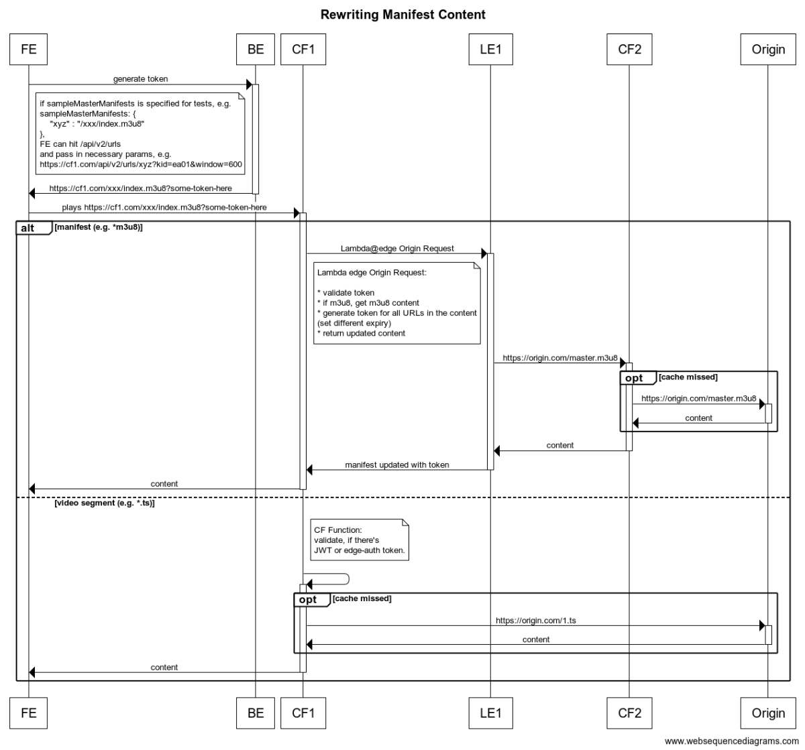

# Context

This repo implements secure media delivery at edge (Amazon CloudFront), with 3 different variants
* Using JWT Token. 
  * Some scripts are copied and modified from https://github.com/aws-solutions/secure-media-delivery-at-the-edge-on-aws
* Using CloudFront Signed URL
  * Some scripts are copied and modified from https://github.com/aws-samples/amazon-cloudfront-protecting-hls-manifest-with-signed-url
* Using Akamai Edge Auth
  * Scripts copied and modified from https://github.com/akamai/EdgeAuth-Token-Node


## How to Deploy

* Modify [secure-media-cloudfront-dist.ts](./bin/secure-media-cloudfront-dist.ts)
  * Choose one of three stacks available
    * [EdgeAuthProtectedStack](./lib/edge-auth-protected-stack.ts)
    * [JwtProtectedStack](./lib/jwt-protected-stack.ts)
    * [SignedUrlProtectedStack](./lib/signed-url-protected-stack.ts)
  * Prepare the origin configuration, i.e. HTTP or S3 origin.
    * The examples in [secure-media-cloudfront-dist.ts](./bin/secure-media-cloudfront-dist.ts) are using S3 and MediaPackage origin that are deployed from
      * [VOD on AWS Foundation](https://docs.aws.amazon.com/solutions/latest/video-on-demand-on-aws-foundation/solution-overview.html), origin in S3
      * [VOD on AWS](https://docs.aws.amazon.com/solutions/latest/video-on-demand-on-aws/overview.html), origin in MediaPackage
    * You can follow corresponding documentation to deploy those solutions
  * Define your keys
    * See the example in [secure-media-cloudfront-dist.ts](./bin/secure-media-cloudfront-dist.ts)
  * Optionally, set the example manifests for your testing
* Once configuration is complete, deploy

```bash
cdk deploy --all --require-approval never
```

### Flow

